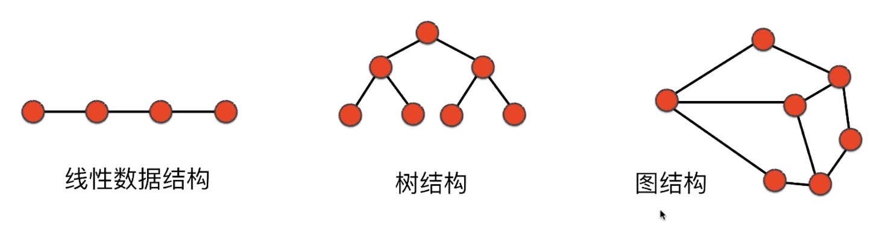
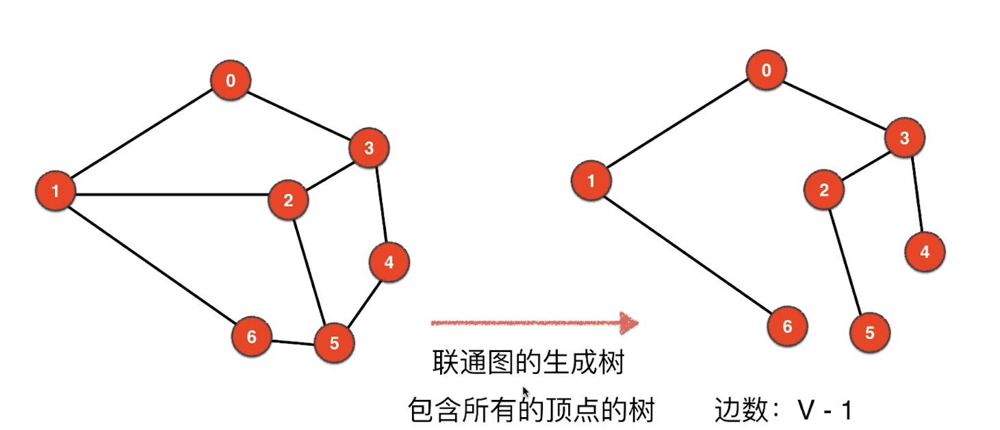
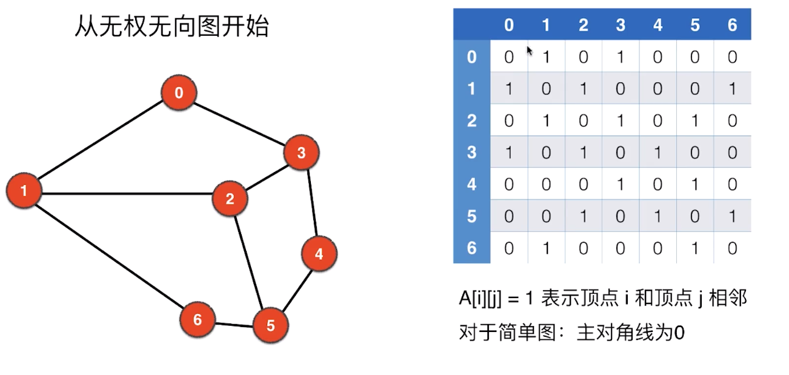

# play-with-graph
#  第一个问题关于图的表示

# 图的表示
	

## 社交网路

## 图的分类算法
无向无权图 
无向有权图 
有向无权图 
有向有权图

# 图的基本概念
## 	无向无权图

没有自环边，没有平行边， 称为简单图

### 联通分量 
	一个图的所有节占不一定全部相连 
	一个图可能有多个联通分量

###  无环图 
	树是一种无环图。无环图不一定是树
	联通的无环图就是树

## 包含所有顶占边数V·1， 一定是联通图的生成树吗？

	不是！

###  一个图一定有生成树吗？

	没有

### 一个顶点的度 

##  邻接矩阵

[实现code](https://github.com/HuichuanLI/play-with-graph-algorithme/blob/master/src/AdjMatrix.java)

复杂度

	可以优化空间复杂度 O(V2)
	如果一个图有3000个节点
	空间：5999vs3000^2约1000万 
	求相邻顶点．degree(v)vs3000

